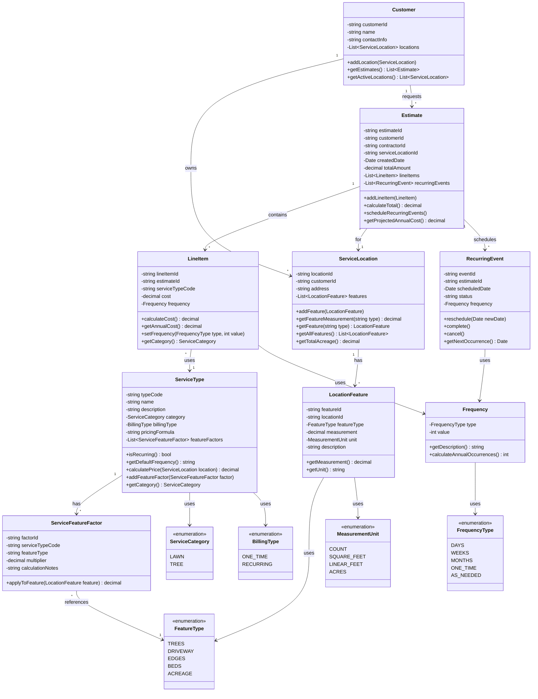

# Class Diagram

Based on the lawn care estimation system sketch, here is the object-oriented class structure:

## Class Descriptions

### Customer
Represents a client who owns one or more service locations and can request estimates.

**Key Responsibilities:**

- Manage multiple service locations
- Request and track estimates
- Store contact information

### Estimate
A collection of line items representing services for a customer at a location.

**Key Responsibilities:**

- Act as a container for line items
- Aggregate line item costs into total
- Track estimate metadata (date, customer, location)
- Generate recurring events from line items
- Calculate projected annual cost from all line items

**Business Rules:**

- Pure aggregation - no direct service logic
- Each line item handles its own pricing and frequency
- Total cost is sum of all line item costs
- Projected annual cost considers each line item's frequency
- Estimate exists to group related services together

### LineItem
Individual services within an estimate with specific pricing and frequency.

**Key Responsibilities:**

- Track individual service costs
- Store frequency (type + value) for the service
- Calculate annual cost based on frequency
- Reference service type for pricing calculation
- Derive category from associated ServiceType

**Examples:**

- Lawn mowing every 2 weeks: serviceType="lawn_mowing" (category=LAWN), frequency.type=WEEKS, frequency.value=2
- Monthly leaf blowing: serviceType="leaf_blowing" (category=LAWN), frequency.type=MONTHS, frequency.value=1
- One-time tree removal: serviceType="tree_removal" (category=TREE), frequency.type=ONE_TIME, frequency.value=1
- Tree trimming as-needed: serviceType="tree_trimming" (category=TREE), frequency.type=AS_NEEDED

### ServiceType
Catalog of available services with formula-based pricing and categories.

**Key Responsibilities:**

- Define service offerings with category (LAWN or TREE)
- Specify billing type (one-time vs recurring)
- Store pricing formulas that reference location features
- Calculate service cost based on location measurements
- Manage feature factors for dynamic pricing

**Examples:**

- **Lawn mowing** (LAWN): Uses total acreage
- **Leaf blowing** (LAWN): Uses trees count + total acreage
- **Driveway blowing** (LAWN): Uses driveway square footage + trees count
- **Edge maintenance** (LAWN): Uses linear feet of edges
- **Tree removal** (TREE): One-time service, per tree pricing
- **Tree trimming** (TREE): Per tree or hourly
- **Stump grinding** (TREE): Per stump
- **Equipment rental**: Flat rate (work ute, crane rental)

### ServiceCategory
Enumeration for categorizing services by area.

**Values:**

- **LAWN**: Services related to lawn care (mowing, fertilizing, leaf removal, edge maintenance, etc.)
- **TREE**: Services related to tree care (removal, trimming, stump grinding, etc.)

### ServiceFeatureFactor
Defines how physical features contribute to service pricing.

**Key Responsibilities:**

- Link service types to specific location features
- Store multiplier values for calculations
- Document calculation logic

**Examples:**

- Leaf blowing + trees: $5/tree
- Leaf blowing + acreage: $50/acre
- Driveway blowing + driveway: $0.10/sqft
- Lawn mowing + acreage: $75/acre

### ServiceLocation
Physical property where services are performed.

**Key Responsibilities:**

- Store property address
- Manage collection of measurable features
- Provide access to feature measurements
- Calculate total acreage from feature data

**Note:** Total acreage is stored as a LocationFeature, not a direct property.

### LocationFeature
Physical, measurable properties of a service location.

**Key Responsibilities:**

- Store measurements of physical features
- Track units of measurement
- Support pricing calculations

**Feature Types:**

- **Trees**: Count of trees on property
- **Acreage**: Total property size in acres
- **Driveway**: Square footage of driveway area
- **Beds**: Square footage of planting beds
- **Edges**: Linear feet of edges requiring maintenance

**Measurement Units:**

- COUNT: For countable items (trees)
- SQUARE_FEET: For area measurements (driveway, beds)
- LINEAR_FEET: For length measurements (edges)
- ACRES: For large area measurements (total property)

### Frequency
Represents a recurring schedule with a type and value.

**Key Responsibilities:**

- Combine frequency type (days/weeks/months) with numeric value
- Calculate annual occurrences (e.g., "every 2 weeks" = 26 times/year)
- Provide human-readable descriptions

**Examples:**

- Type: WEEKS, Value: 2 = "Every 2 weeks" (26 occurrences/year)
- Type: MONTHS, Value: 1 = "Monthly" (12 occurrences/year)
- Type: DAYS, Value: 7 = "Every 7 days" (52 occurrences/year)
- Type: ONE_TIME, Value: 0 = "One-time service" (1 occurrence)

### RecurringEvent
Scheduled instance of a recurring service.

**Key Responsibilities:**

- Track individual service occurrences
- Manage scheduling and rescheduling
- Track completion status
- Calculate next occurrence based on frequency

**Business Rules:**

- Can be added later for billing purposes
- Supports flexible scheduling based on Frequency object
- Enables tracking of actual vs. estimated occurrences

## Design Patterns

### Composition Pattern

- `Estimate` composes multiple `LineItem` objects
- `ServiceLocation` composes multiple `LocationFeature` objects
- `LineItem` can generate multiple `RecurringEvent` objects

### Strategy Pattern

- Different billing strategies based on `BillingType` (one-time vs recurring)
- Different calculation strategies based on `ServiceFeatureFactor` multipliers
- Frequency calculations vary by `FrequencyType`

### Factory Pattern

- `RecurringEvent` objects can be generated from `LineItem` based on frequency
- Service price calculations are generated dynamically from `ServiceFeatureFactor` configurations
