# Entity Relationship Diagram

Based on the lawn care estimation system sketch, here are the identified entities and their relationships:

```mermaid
erDiagram
    CUSTOMER ||--o{ ESTIMATE : requests
    ESTIMATE ||--|{ LINE_ITEM : contains
    ESTIMATE ||--o{ RECURRING_EVENT : schedules
    LINE_ITEM ||--|| SERVICE_TYPE : "is of type"
    SERVICE_TYPE ||--o{ SERVICE_FEATURE_FACTOR : "uses factors"
    SERVICE_LOCATION }o--|| CUSTOMER : "belongs to"
    SERVICE_LOCATION ||--o{ LOCATION_FEATURE : has
    ESTIMATE }o--|| SERVICE_LOCATION : "for"

    CUSTOMER {
        string customer_id PK
        string name
        string contact_info
    }

    ESTIMATE {
        string estimate_id PK
        string customer_id FK
        string contractor_id FK
        string service_location_id FK
        date created_date
        decimal total_amount
    }

    LINE_ITEM {
        string line_item_id PK
        string estimate_id FK
        string service_type_code FK
        decimal cost
        enum frequency_type "days, weeks, months, one-time, as-needed"
        int frequency_value
    }

    SERVICE_TYPE {
        string type_code PK
        string name
        string description
        enum category "lawn, tree"
        string billing_type "one-time or recurring"
        string pricing_formula "e.g., base_rate + (trees * tree_factor) + (acreage * acreage_factor)"
    }

    SERVICE_FEATURE_FACTOR {
        string factor_id PK
        string service_type_code FK
        enum feature_type "trees, driveway, beds, edges, acreage"
        decimal multiplier
        string calculation_notes
    }

    SERVICE_LOCATION {
        string location_id PK
        string customer_id FK
        string address
    }

    LOCATION_FEATURE {
        string feature_id PK
        string location_id FK
        enum feature_type "trees, driveway, beds, edges, acreage"
        decimal measurement
        enum unit "count, square_feet, linear_feet, acres"
        string description
    }

    RECURRING_EVENT {
        string event_id PK
        string estimate_id FK
        date scheduled_date
        string status
        enum frequency_type "days, weeks, months, one-time, as-needed"
        int frequency_value
    }
```

## Entity Descriptions

### CUSTOMER
Represents the client requesting lawn care services.

### ESTIMATE
A collection of line items for a customer at a service location.

- Pure aggregation of line items
- Total cost is sum of all line items
- Projected annual cost calculated from line item frequencies
- No direct service logic - all handled by line items

### LINE_ITEM
Individual services within an estimate with their own frequency settings:

- Links to SERVICE_TYPE for pricing calculation and category
- Has frequency (type + value) for recurring services
- Examples:
  - Lawn mowing: frequency_type=WEEKS, frequency_value=2 (every 2 weeks)
  - One-time tree work: frequency_type=ONE_TIME, frequency_value=1
  - Monthly lawn maintenance: frequency_type=MONTHS, frequency_value=1

### SERVICE_TYPE
Catalog of available services with pricing formulas and categories:

- Each service type has a category (LAWN or TREE)
- **Lawn mowing** (LAWN): Calculated based on total acreage
- **Leaf blowing** (LAWN): Calculated based on number of trees + total acreage
- **Driveway blowing** (LAWN): Calculated based on driveway square footage + number of trees
- **Spreading straw** (LAWN): Based on acreage
- **Edge maintenance** (LAWN): Based on linear feet of edges
- **Tree removal** (TREE): One-time service, flat rate or per tree
- **Tree trimming** (TREE): Per tree or hourly
- **Stump grinding** (TREE): Per stump
- **Equipment rental**: Flat rate or hourly (work ute, crane rental)

### SERVICE_FEATURE_FACTOR
Defines how physical features affect service pricing:

- Links service types to location features
- Stores multipliers for calculations
- Examples:
  - "Leaf blowing" uses: trees (multiplier: $5/tree) + acreage (multiplier: $50/acre)
  - "Driveway blowing" uses: driveway_sqft (multiplier: $0.10/sqft) + trees (multiplier: $3/tree)
  - "Lawn mowing" uses: acreage (multiplier: $75/acre)

### SERVICE_LOCATION
The physical property being serviced:

- Address information
- Contains multiple measurable features
- Total acreage stored as a location feature

### LOCATION_FEATURE
Physical, measurable properties of the service location:

- **Trees**: Count of trees on property
- **Acreage**: Total property size in acres
- **Driveway**: Square footage of driveway area
- **Beds**: Square footage of planting beds
- **Edges**: Linear feet of edges requiring maintenance
- Each feature has a measurement value and unit (count, square feet, linear feet, acres)

### RECURRING_EVENT
Scheduled instances of recurring services that can be tracked:

- Generated from line items with recurring frequencies
- Weekly mowing, monthly maintenance, etc.
- As-needed services
- Can be added later for billing purposes
