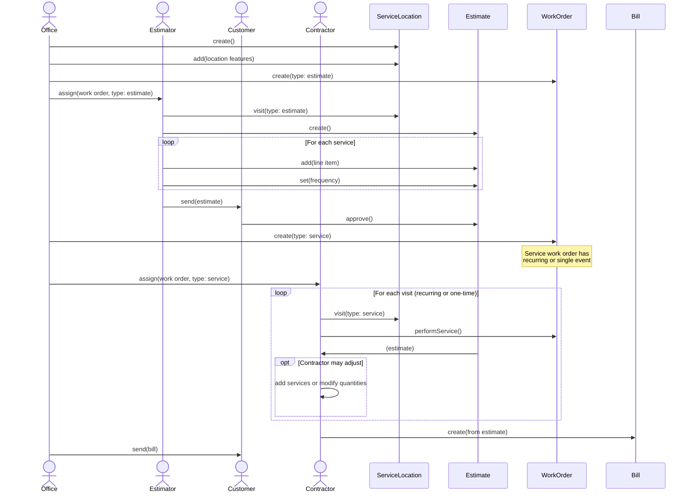

# Sequence Diagram

This sequence diagram shows the interactions between actors and system components when creating an estimate and managing work orders.

## Sequence Flow Description

### Phase 1: Service Location Setup

**Actor**: Office

1. Office creates a ServiceLocation
2. Office adds location features (trees, acreage, driveway, beds, edges)

### Phase 2: Work Order for Estimate

**Actor**: Office

1. Office creates a WorkOrder with type "estimate"
2. Office assigns the work order to Estimator

### Phase 3: Estimate Creation

**Actor**: Estimator

1. Estimator visits the ServiceLocation (visit type: estimate)
2. Estimator creates an Estimate
3. For each service:
   - Add line item to estimate
   - Set frequency for the line item

### Phase 4: Approval

**Actors**: Estimator, Customer

1. Estimator sends estimate to Customer
2. Customer approves the estimate

### Phase 5: Work Order for Service

**Actor**: Office

1. Office creates WorkOrder with type "service" for approved services
2. Service work order contains either:
   - Recurring events (for services with recurring frequency)
   - Single event (for one-time services)
3. Office assigns the work order to Contractor

### Phase 6: Service Execution & Billing

**Actors**: Contractor, Office

1. For each visit (one or more based on work order type):
   - Contractor visits the ServiceLocation (visit type: service)
   - Contractor performs service from WorkOrder
   - Contractor receives Estimate
   - Contractor may add services or modify quantities (optional - based on actual work performed during this visit)
2. After all visits complete:
   - Contractor creates Bill from Estimate
   - Office sends Bill to Customer

**Note**: For recurring services, there may be multiple visits before a bill is created (e.g., weekly lawn mowing billed monthly). The contractor can adjust the estimate during each visit.

## Actor Responsibilities

### Office

- Service location creation and management
- Location feature data entry
- Work order creation for estimates
- Work order creation for services
- Assigning work orders to estimators
- Assigning work orders to contractors
- Sending bills to customers
- Administrative support

### Estimator

- Visiting service locations (via work order)
- Estimate creation
- Line item management
- Frequency setting
- Sending estimates to customers

### Customer

- Reviewing estimates
- Approving estimates

### Contractor

- Visiting service locations (via work order)
- Service execution
- Field work
- Receiving estimates
- Adding services or modifying quantities based on actual work performed (optional)
- Creating bills from estimates

## System Components

### ServiceLocation

- Physical property where services are performed
- Contains location features (trees, acreage, driveway, beds, edges)

### Estimate

- Collection of line items
- Each line item has a service type and frequency
- Sent to customer for review
- Approved by customer before work order creation
- Provided to contractor upon service execution
- May be modified by contractor based on actual work performed
- Used to create bill

### WorkOrder

- Has a type field that determines its purpose:
  - **Type: Estimate** - Created by office and assigned to estimator to visit location and create estimate
  - **Type: Service** - Created by office from approved estimate, contains recurring or single event, assigned to contractor for execution

### Bill

- Invoice for completed work
- Created by contractor from the estimate after service completion
- May cover multiple service visits (especially for recurring services)
- Contains line items and pricing from the estimate (potentially modified by contractor)
- Reflects actual work performed across all visits
- Sent to customer by office
